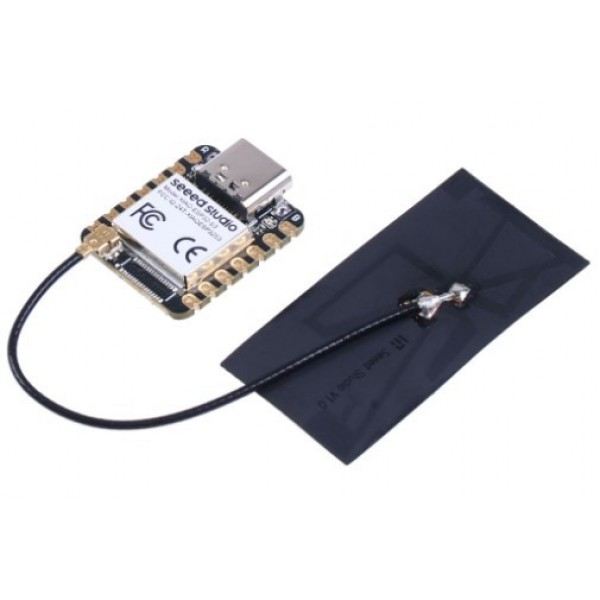
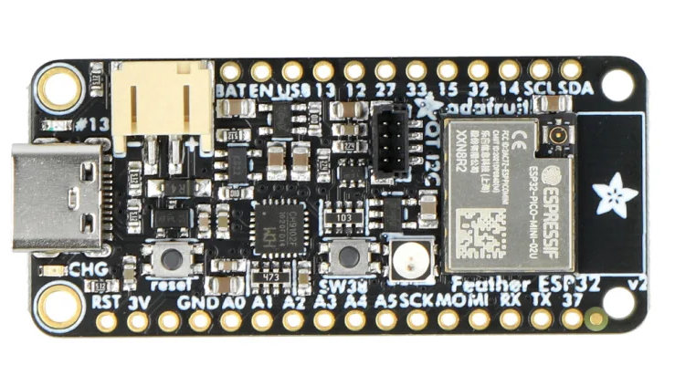

#  Tacx-Virtual-Shifting

**Virtual Shifting (VS) for Legacy Smart Tacx trainers that are deprived of the Tacx VS-enabling firmware update.**

## 🚴 What is Virtual Shifting (VS)?
Virtual Shifting lets you “change gears” on your smart trainer without touching your bike’s drivetrain.  
Instead of physically moving your chain across cogs, software simulates different gear ratios and adjusts trainer resistance accordingly.  

This feature is standard on newer Tacx trainers — but older models never received the firmware update. That’s where this project comes in.  

**Goal:** Bring VS to legacy Tacx trainers so that cyclists can enjoy the benefits of shifting *without needing to buy new hardware*.  

### 🔧 What do you need to try Virtual Shifting?
At the very minimum, you need:  
- A **Tacx smart trainer** (legacy model without VS support).  
- A **Zwift Click device** (tested and working).
    - The Click is handy because it can be moved around and mounted in different spots on the handlebars and elsewhere. Notice that these are also offered in online marketplaces now by people that have bought later a Zwift Play device.

👉 That’s it! No need for extra gadgets.  

- **No Zwift Cog required** — just keep your bike chain in an optimal straight chain line, like in gear **34/17** or optimize chain position for your setup.  
- **No Zwift Play required** — although it will likely work as well if you own one.  

This project bridges your trainer and Zwift so that **pressing shift buttons on Zwift Click** feels like changing gears on a VS-enabled trainer.  

## 🌟 Why this project?
- Many Tacx smart trainers are still working great but lack VS.  
- Garmin/Tacx enabled VS on **ONLY** selected new models.
  - Later than Wahoo and Elite, Garmin/Tacx deployed in the summer of 2025 a VS firmware update for recent Tacx smart trainers!
- At minimal cost this project can unlock a similar experience and increase the durability of your trainer. 
- This repo provides **an Arduino library + concise examples** so you can try VS yourself.  

## 📦 What you’ll find here
- **`/src`** → the C++ library (building blocks for VS).  
- **`/examples`** → ready-to-run demos showing how to connect and shift.  
- **`/docs`** → background info on Tacx protocols, VS concepts, and troubleshooting.  

## 🛠 Who is this for?
This project is written with **novice programmers who are also cyclists** in mind.  
If you:  
- Have a Tacx smart trainer,  
- Are curious about VS,  
- Know a little Arduino programming (or want to learn), then this repo is for you. 🚀  

You don’t need to hack the internals — just upload the example sketches and start experimenting.  

## 📚 Dependencies
Hardware
+ **Supported MCU's** with **NimBLE-Arduino**
    - Espressif: ESP32, ESP32C3, ESP32S3

This **Tacx-Virtual-Shifting** library relies on the following Arduino libraries:
+ Arduino core for ESP32
  - [Arduino core for ESP32](https://github.com/espressif/arduino-esp32)

+ NimBLE-Arduino (v2.x) → for Bluetooth Low Energy communication.
  - [NimBLE-Arduino version 2.x](https://github.com/h2zero/NimBLE-Arduino)

+ ULEB128 → Unsigned little endian base 128 implementation for encoding and decoding
  - [uleb128](https://github.com/bolderflight/uleb128)

You can install these directly through the Arduino IDE Library Manager or by cloning the repos to your Arduino/libraries folder.

## 🖥️ Supported Tacx Hardware

This project is designed for legacy Tacx **smart** trainers that do not natively support VS.

Tested so far on my own trainer:

- Tacx Neo (T2800) of the first generation (about september 2015).

Expected compatibility:
- Most **smart** Tacx FE-C compatible trainers without VS-enabled firmware like:
  - Genius Smart,
  - Bushido Smart,
  - Vortex Smart,
  - Flow Smart,
  - Satori Smart
  - and NEO

⚠️ If you test this on another model, please share your results in an issue so we can update the list.

## 🔌 Tested Boards

This project has been tested successfully with the following ESP32 development boards:  
- **Seeed Studio XIAO ESP32S3**

 

- **Adafruit Feather ESP32 V2**

 

Both boards work reliably with this project. Check pricing and availability! 

Each board has its own **setup instructions** in `/docs` to ensure correct pin configuration and library installation.
- **[Seeed Studio XIAO ESP32S3](docs/XIAO_ESP32S3_Sense.md)**
- **[Adafruit Feather ESP32 V2](docs/Adafruit%20Feather%20ESP32-V2.md)**

👉 Other ESP32-based boards may work as well, but are not tested yet.  
If you try a different board, please share your results via an issue.  

## ⚡ Getting Started
1. **Install Arduino IDE 2.x** → [Download here](https://www.arduino.cc/en/software).  
2. Install the **Tacx-Virtual-Shifting** library from this repository. Download as `.zip` and extract to `Arduino/libraries` folder, or  in <b>Arduino IDE</b> from `Sketch menu` -> `Include library` -> `Add .Zip library` 
3. **Open Arduino IDE** → load the examples/ sketches.
4. **Install required libraries** using Arduino IDE Library Manager (see Dependencies).
5. **Setup `IDE` -> `Tools menu`** for the type of board you are using!
6. **Upload to your device** → run the example and try Virtual Shifting!

## 🙏 Credits

This project builds on the work of several excellent open-source projects.  

- **[NimBLE-Arduino](https://github.com/h2zero/NimBLE-Arduino)** — Bluetooth Low Energy library (Apache 2.0 License)  
- **[uleb128](https://github.com/bolderflight/uleb128)** — Unsigned LEB128 encoding/decoding (MIT License)  
- **[SHIFTR](https://github.com/JuergenLeber/SHIFTR)** — Virtual shifting implementation (GPL-3.0 License)  
- **[qdomyos-zwift](https://github.com/cagnulein/qdomyos-zwift)** — BLE-to-Zwift integration (GPL-3.0 License)  

Full attribution and license details are included in [NOTICE.txt](NOTICE.txt).  

## ⚖️ License
This project is licensed under the **GNU General Public License v3.0 (GPL-3.0)**.  
You may freely use, modify, and distribute this project, provided that any derivative work is also licensed under GPL-3.0.  

See the [LICENSE](LICENSE) file for full details.

## ⚠️ Disclaimer

💡 <b>Research & Independence</b>

This project is <b>not affiliated with, endorsed by, or associated with any commercial virtual cycling platform or trainer manufacturer</b>.  
It is a <b>research and interoperability</b> initiative designed to explore ways to <b>increase the durability of legacy indoor bike trainers</b>.  
All development is conducted independently for <b>educational and experimental purposes</b>.  

✅ <b>Compliance & Responsibility</b>
 

This repository does <b>not include or promote any circumvention of technological protection measures</b>, reverse engineering of proprietary software, or unauthorized access to restricted systems.  
Users are <b>solely responsible</b> for ensuring that their use of this code complies with <b>local laws, software licenses, and platform terms of service</b>.  

🔍 <b>Copyright & Contact</b>

If you are a <b>rights holder</b> and believe that this project includes content that <b>violates your intellectual property rights</b>, please <b>open an issue</b> on this repository to initiate a respectful review.  
We are committed to responding promptly and, if appropriate, taking corrective action.  

## ❤️ Contributing

This project is just starting!
If you’re interested in testing, coding, writing docs, or just giving feedback, contributions are welcome.

⚖️ <b>Legal Notice (EU Context)</b>

This project is developed and published in accordance with **EU directives** that recognize the right to study, test, and develop software components for the purpose of achieving **interoperability** (e.g., Directive 2009/24/EC on the legal protection of computer programs, Article 6).  

No part of this project is intended to **infringe upon intellectual property rights** or violate technological protection measures. All content is shared in good faith under the belief that it falls within the bounds of **legitimate research, reverse engineering for interoperability, and fair use under EU law**.  

Users must ensure their own compliance with **national implementations of EU directives**, and are responsible for how they apply or modify this code.

