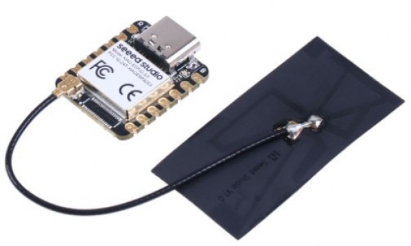

#  Tacx-Virtual-Shifting

**Virtual Shifting (VS) for Legacy Smart Tacx trainers that are deprived of the Tacx VS-enabling firmware update.**

## 🚴 What is Virtual Shifting (VS)?
Virtual Shifting lets you “change gears” on your smart trainer without touching your bike’s drivetrain.  
Instead of physically moving your chain across cogs, software simulates different gear ratios and adjusts trainer resistance accordingly.  

This feature is standard on newer Tacx trainers — but older models never received the firmware update. That’s where this project comes in.  

**Goal:** Bring VS to legacy Tacx trainers so that cyclists can experience the benefits of virtual shifting *without needing to buy new trainer hardware*.  

## 🔧 What do you need to try Virtual Shifting?
At the very minimum, you need:  
- A **Tacx smart trainer** (legacy model without VS support).  
- A **Zwift Click device** (tested and working).
    - The Click is handy because it can be moved around and mounted in different spots on the handlebars and elsewhere. Notice that these are also offered in online marketplaces now, by people that have bought later a Zwift Play device.

👉 That’s it! No need for extra gadgets.  

- **No Zwift Cog required** — just align your bike chain in an optimal straight line, like in gear **34/17**. 
- **No Zwift Play required** — although it will likely work as well if you own one.  

This project bridges your trainer and Zwift so that **pressing shift buttons on Zwift Click** feels like changing gears on a VS-enabled trainer. 

> **Note:** This bridge only controls trainer resistance.  
> It does not modify or fake your power, cadence, heart rate, or Zwift ride data in any way.

## 🌟 Why this project?
- Many Tacx smart trainers are still working great but lack VS.
- At minimal cost this project can unlock a similar experience and extend the lifespan of your trainer. 
- Garmin/Tacx has enabled VS on **ONLY** selected new models.
  - Later than Wahoo and Elite, Garmin/Tacx deployed in the summer of 2025 a VS firmware update for recent Tacx smart trainers!
- This repo provides **an Arduino library + concise examples** so you can try VS yourself.  

## 🛠 Who is this for?
This project is written with (novice) **programmers who are also cyclists** in mind.  
If you:  
- Have a Tacx smart trainer that is deprived of the Garmin/Tacx VS-enabling firmware update  
- Are curious about VS,  
- Know a little Arduino programming (or want to learn), then this repo is for you. 🚀  

You don’t need to hack the internals — just upload the example sketche(s) and start experimenting.  

## 📦 What you’ll find here
- **`/src`** → the C++ library (building blocks for VS).
- **`/src/config`** → configuration settings
- **`/examples`** → ready-to-run demos showing how to connect and shift.  
- **`/docs`** → background info and board setup.
- 
## 🪄 How the code works?
At its core, this project acts as a **bridge** between Zwift Virtual Shifting (VS) and the legacy smart Tacx trainer.  
Zwift sends commands over BLE in formats that the smart Tacx does not natively understand. The bridge intercepts these commands, interprets whether Zwift is asking for a target power, a road gradient, or a virtual gear change, and then translates them into the **ANT+ FE-C messages** that the trainer *does* support.  
In this way, the legacy smart Tacx trainer behaves as if it had native Zwift VS support, even though its firmware was never updated for it.

<b>Supported Trainer Modes</b>

The bridge implements three distinct modes that mirror how Zwift communicates with smart trainers.  
Which mode is active is not set explicitly by Zwift, but is inferred from the type of data Zwift VS sends.

- **ERG_MODE**  
  When Zwift sends a *Target Power* command (e.g. during a workout block in a `.zwo` file), the bridge switches into ERG mode.  
  In this mode the trainer is controlled purely by power targets: the smart Tacx is instructed to hold the requested wattage, regardless of cadence, speed, or gear.

- **SIM_MODE**  
  When Zwift sends a *grade value* (`zwiftGrade`) without virtual shifting active, the bridge passes this value directly on to the trainer using the FE-C Track Resistance page.  
  The trainer then applies resistance according to the simulated slope, just like in a normal Zwift ride without VS enabled.

- **SIM_MODE + Virtual Shifting**  
  When Zwift VS sends a non-zero *gear ratio*, the bridge switches into Virtual Shifting mode.  
  Here the raw grade from Zwift is not used directly; instead, the bridge calculates an *effective grade* that takes into account the rider’s cadence, the chosen virtual gear ratio, total weight and resistance forces.  
  This reconstructed grade is then sent as FE-C Track Resistance, making the smart Tacx behave as if it natively supported Zwift’s virtual gearing.

In short:  
- **Target Power received → ERG mode**  
- **Grade received without gear ratio → SIM mode**  
- **Gear ratio received → Virtual Shifting mode**  

This automatic detection ensures that the smart Tacx follows Zwift’s logic seamlessly, even though it never received official firmware support for Virtual Shifting.

<b>How is Tacx FEC Track Resistance Grade calculated?</b>

The workhorse function that does the core of the calculations, sits at the heart of the ESP32 Virtual Shifting → smart Tacx bridge. The function/member is a.k.a. `UTILS::calculateFECTrackResistanceGrade(..)` and can be found for further inspection at `/src/utilities.cpp`.
Its role is to take the information Zwift VS provides — **gear ratio**, **grade**, **rider and bike weight**, **CRR** and **Cw** — and translate it into something the smart Tacx understands: an ANT+ FE-C Track Resistance grade.

The calculation begins by applying two kinds of speed. On the one hand we have the **virtual Speed**, which is derived from the rider’s cadence, the selected virtual gear ratio, and the assumed wheel diameter. This represents how fast the bike *would* be going out on the road. On the other hand, there is the **measured Speed** reported by the trainer’s flywheel. This represents what the trainer is actually doing at that moment. These two speeds form the basis for all subsequent resistance forces.

From there, the function reconstructs the three major forces acting on a rider in Zwift’s simulation:

- **Rolling resistance**, which depends only on the total system weight and remains fairly constant.
- **Wind resistance**, which Zwift models based purely on the rider’s speed through the air. Since Zwift itself does not add random wind gusts for solo riding, the calculation uses the measured speed reported by the trainer.
- **Gravitational resistance**, which is where the magic of virtual shifting comes in. Using the virtual speed, the rider’s total weight, and the grade supplied by Zwift, the function determines how much of the resistance should come from climbing or descending.

All three contributions are added together and compared against the theoretical resistance one would expect from riding a given slope outdoors. From this, the function reconstructs an **effective gradient** — essentially the slope that best explains the resistance forces the rider should be feeling under Zwift’s physics model. This effective gradient is then encoded into FE-C Track Resistance format, where `0x4E20` represents a flat road, and each step corresponds to 0.01% grade.

A few safeguards ensure that the ride feels natural. Zwift already halves downhill grades before sending them to the trainer, so the function does not apply any further scaling — avoiding the pitfall of double-reducing descents. Likewise, extreme slopes are clipped to a realistic range of ±25%, which prevents sudden spikes in resistance and keeps the trainer within its mechanical limits.

The end result is that, whether the rider is shifting gears, rolling down a virtual hill, or grinding up Alpe du Zwift, the smart Tacx receives a smooth and believable track resistance signal. The trainer “thinks” it is simply following a gradient profile, while in reality it is being fed a carefully reconstructed version of Zwift’s virtual world.

 <b>Accuracy and Transparency</b>

A common concern when using a bridge or simulation algorithm is whether it might interfere with the key performance data that Zwift displays: **power, cadence, heart rate, and speed**.  
It is important to stress that this project does **not** alter or fabricate any of these values.

- **Power and cadence** are always measured directly by the smart Tacx trainer and reported unchanged to Zwift.  
- **Heart rate** is passed through directly from your sensor without modification.  
- **Speed** as shown in Zwift is determined by Zwift’s own physics engine (road gradient, drafting, and rider profile), not by the bridge.  

What the bridge does is limited to **resistance control only**: it translates Zwift’s Virtual Shifting and gradient commands into ANT+ FE-C messages that the smart Tacx can understand.  
This affects how the trainer feels under your legs, but never the numbers that Zwift records or displays.

In short:  
The bridge makes your smart Tacx respond correctly to Zwift VS commands, but your power output and ride data remain 100% authentic and untouched.

## 📚 Dependencies
**ESP32 MCU Hardware**

+ **Supported MCU's** with **NimBLE-Arduino**
    - Espressif: ESP32, ESP32C3, ESP32S3

**Software**

This **Tacx-Virtual-Shifting** library relies on the following Arduino libraries:
+ Arduino core for ESP32
  - [Arduino core for ESP32](https://github.com/espressif/arduino-esp32)

+ NimBLE-Arduino (v2.x) → for Bluetooth Low Energy communication.
  - [NimBLE-Arduino version 2.x](https://github.com/h2zero/NimBLE-Arduino)

+ ULEB128 → Unsigned little endian base 128 implementation for encoding and decoding
  - [uleb128](https://github.com/bolderflight/uleb128)

You can install these directly through the Arduino IDE Library Manager or by cloning the repos to your Arduino/libraries folder.

## 🖥️ Supported Tacx Hardware

This project is designed for legacy Tacx **smart** trainers that do not natively support VS.

Tested so far on my own trainer:

- Tacx Neo (T2800) of the first generation (about september 2015).

Expected compatibility:
- Most **smart** Tacx FE-C compatible trainers without VS-enabled firmware like:
  - Genius Smart,
  - Bushido Smart,
  - Vortex Smart,
  - Flow Smart and
  - Satori Smart.

⚠️ If you test this on another model than the Neo, please share your results in this [[Feedback Issue]](https://github.com/Berg0162/Tacx-Virtual-Shifting/issues/1#issue-3366715494).

## 🔌 Tested Boards

This project has been tested successfully with the following ESP32 MCU boards:  
- **Seeed Studio XIAO ESP32S3**

 

- **Adafruit Feather ESP32 V2**

 

Both boards work reliably with this project. Check pricing and availability! 

Each board has its own **setup instructions** in `/docs` to ensure correct configuration and library installation.
- **[Seeed Studio XIAO ESP32S3](docs/XIAO_ESP32S3.md)**
- **[Adafruit Feather ESP32 V2](docs/Adafruit%20Feather%20ESP32-V2.md)**

👉 Other ESP32-based boards may work as well, but are not tested.  
If you try a different board, please share your results via this [[Feedback Issue]](https://github.com/Berg0162/Tacx-Virtual-Shifting/issues/1#issue-3366715494).  

## ⚡ Getting Started
1. **Install Arduino IDE 2.x** → [Download here](https://www.arduino.cc/en/software).  
2. Install the **Tacx-Virtual-Shifting** library from this repository. Download as `.zip` and extract to `Arduino/libraries` folder, or  in <b>Arduino IDE</b> from `Sketch menu` -> `Include library` -> `Add .Zip library` 
3. **Open Arduino IDE** → load the examples/ sketches.
4. **Install required libraries** using Arduino IDE Library Manager (see Dependencies).
5. **Setup `IDE` -> `Tools menu`** for the type of board you are using!
6. **Upload to your device** → run the example and try Virtual Shifting!

## 🪄 Central configuration
All configuration settings have been gathered in one config directory `../documents/arduino/libaries/Tacx-Virtual-Shifting/src/config` for <b>Debug</b>-, <b>NimBLE</b>- and <b>Tacx</b>-configurations. Check this out: [Configuring Tacx-Virtual-Shifting](src/config/README.md) 

## 🙏 Credits
This project builds on the work of several excellent open-source projects.  
- **[SHIFTR](https://github.com/JuergenLeber/SHIFTR)** — BLE to Direct Connect bridge for bike trainers adding virtual shifting for Zwift (GPL-3.0 License)  
- **[qdomyos-zwift](https://github.com/cagnulein/qdomyos-zwift)** — Zwift bridge for smart treadmills and bike/cyclette (GPL-3.0 License)  
- **[NimBLE-Arduino](https://github.com/h2zero/NimBLE-Arduino)** — Bluetooth Low Energy library (Apache 2.0 License)  
- **[uleb128](https://github.com/bolderflight/uleb128)** — Unsigned LEB128 encoding/decoding (MIT License)  

Full attribution and license details are included in [NOTICE.txt](NOTICE.txt).  

## ⚖️ License
This project is licensed under the **GNU General Public License v3.0 (GPL-3.0)**.  
You may freely use, modify, and distribute this project, provided that any derivative work is also licensed under GPL-3.0.  

See the [LICENSE](LICENSE) file for full details.

## ⚠️ Disclaimer

💡 <b>Research & Independence</b>

This project is <b>not affiliated with, endorsed by, or associated with any commercial  cycling platform or trainer manufacturer</b>.  
It is a <b>research and interoperability</b> initiative designed to explore ways to <b>increase the durability of legacy indoor bike trainers</b>.  
All development is conducted independently for <b>educational and experimental purposes</b>.  

✅ <b>Compliance & Responsibility</b>
 

This repository does <b>not include or promote any circumvention of technological protection measures</b>, reverse engineering of proprietary software, or unauthorized access to restricted systems.  
Users are <b>solely responsible</b> for ensuring that their use of this code complies with <b>local laws, software licenses, and platform terms of service</b>.  

🔍 <b>Copyright & Contact</b>

If you are a <b>rights holder</b> and believe that this project includes content that <b>violates your intellectual property rights</b>, please <b>open a new issue</b> on this repository to initiate a respectful review.  
We are committed to responding promptly and, if appropriate, taking corrective action.  

## ❤️ Contributing

This project is just starting!
If you’re interested in testing, coding, writing docs, or just giving feedback, contributions are welcome. [Feedback Issue](https://github.com/Berg0162/Tacx--Shifting/issues/1#issue-3366715494)

⚖️ <b>Legal Notice (EU Context)</b>

This project is developed and published in accordance with **EU directives** that recognize the right to study, test, and develop software components for the purpose of achieving **interoperability** (e.g., Directive 2009/24/EC on the legal protection of computer programs, Article 6).  

No part of this project is intended to **infringe upon intellectual property rights** or violate technological protection measures. All content is shared in good faith under the belief that it falls within the bounds of **legitimate research, reverse engineering for interoperability, and fair use under EU law**.  

Users must ensure their own compliance with **national implementations of EU directives**, and are responsible for how they apply or modify this code.

