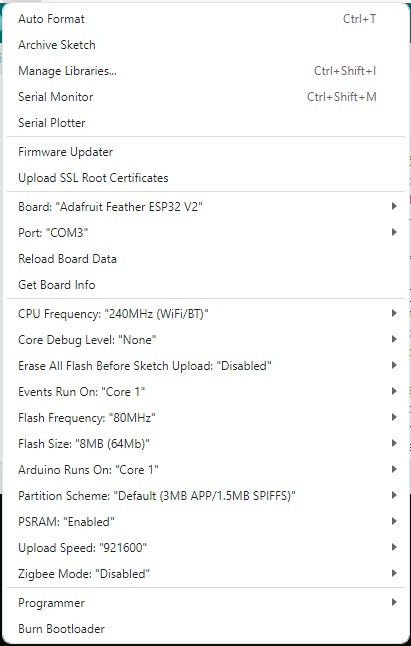
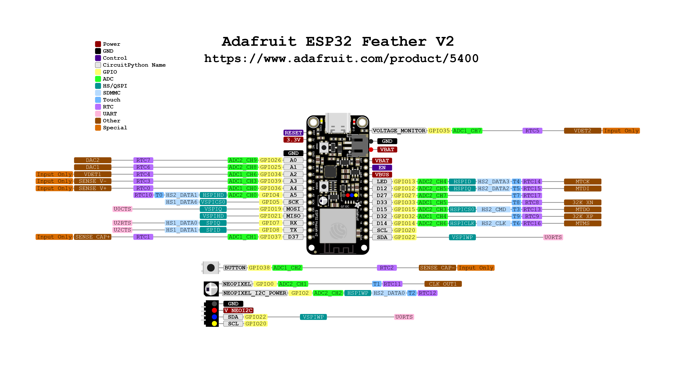

# Tacx-VirtualShifting based on the Adafruit Feather ESP32 V2 board

# Setup Feather ESP32 V2 for Tacx-VirtualShifting

## Arduino IDE 2.x
The present code is developed on Arduino IDE 2.2. Notice that you will need an Arduino IDE that is tailored for this specific <b>Adafruit Feather ESP32 V2</b> processor! Please follow the installation instructions for the [Adafruit Feather ESP32 V2](https://learn.adafruit.com/adafruit-esp32-feather-v2/arduino-ide-setup) 

## Before you start
If you select in the menu bar of Arduino IDE 2.2 <b>Tools</b>, the settings for the <b>Adafruit Feather ESP32 V2</b> processor and the project are the following:

 

# Feather ESP32 V2 pinout

