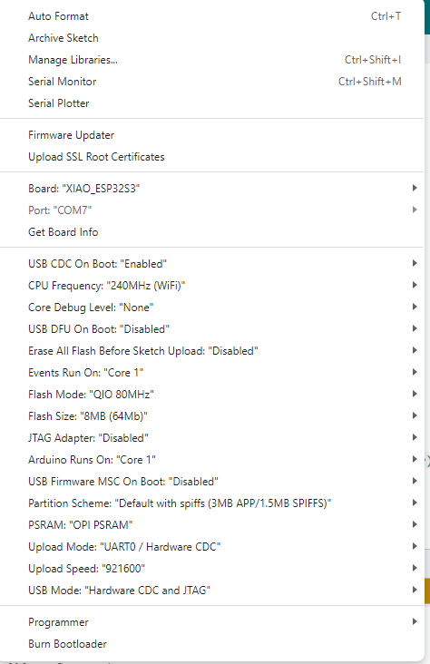
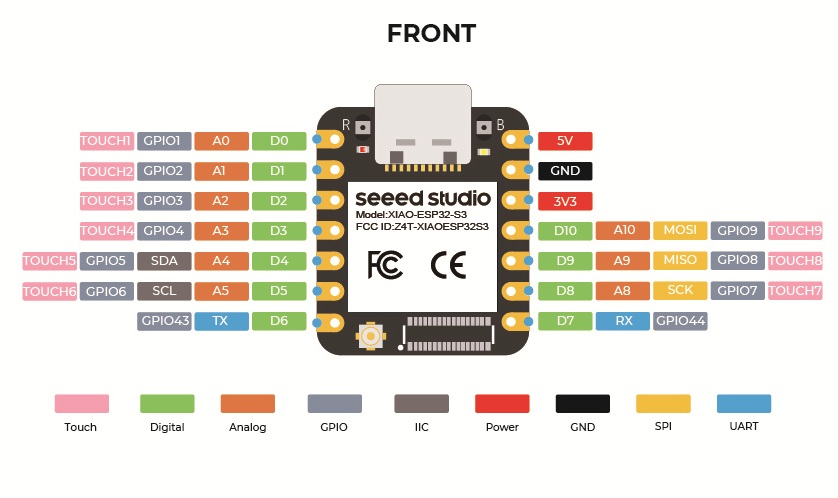

# Tacx-Virtual-Shifting based on the Seeed Studio XIAO ESP32S3 board

# Setup XIAO ESP32S3 for Tacx-Virtual-Shifting

## Arduino IDE 2.x
The present code is developed on Arduino IDE 2.x. Notice that you will need an Arduino IDE that is tailored for this specific <b>Seeed Studio XIAO ESP32S3</b> processor! Please follow the installation instructions for the [Seeed Studio XIAO ESP32S3](https://wiki.seeedstudio.com/xiao_esp32s3_getting_started/) 

## Before you start
If you select in the menu bar of Arduino IDE 2.x <b>Tools</b>, the settings for the <b>XIAO_ESP32S3</b> processor and the project are the following:

 

# XIAO ESP32S3 pinout

